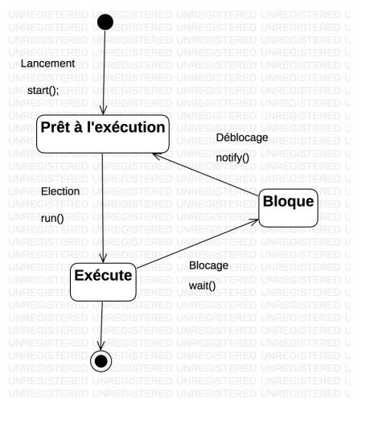

DEGAT Teddy

Compte-rendu
Programmation Répartie

Contexte:

Le but de ce compte-rendu est de réécrire le cours, de commenter les TPs et d'ajouter mes propres raisonnements pour pouvoir relire et m’améliorer plus tard. Dans un premier temps, il comprendra les définitions et toute la partie cours, puis ensuite la partie TP, qui inclura les difficultés que j’ai rencontrées et mon cheminement dans mon raisonnement.

Définitions:

Un *Thread* est un processus léger situé dans le processeur de l’ordinateur, permettant d’effectuer plusieurs tâches en parallèle.

*Schéma représentant les threads (Cores)*

Les threads ont pour particularité de posséder plusieurs états commandités par l’OS, un état “en cours d’exécution” où le thread réalise sa tâche, un état “prêt à l’exécution” où le thread est prêt à démarrer sa tâche, un état “en attente” où le thread attend une tâche, dans cet état, il ne consomme aucune ressource.

Le *Multithreading* est une technique permettant d’utiliser plusieurs threads au sein d’un même processus pour optimiser l’utilisation du processeur. Le multithreading permet d’exécuter plusieurs tâches en parallèle. Cependant, cela peut entraîner des problèmes de concurrence, car plusieurs threads peuvent accéder aux mêmes données simultanément et les modifier de manière incohérente. Pour éviter ces problèmes, on utilise des verrous (ou locks), qui empêchent plusieurs threads d’accéder aux mêmes données simultanément.

*Cycle de vie d’un Thread*

Une *Ressource Critique* est une ressource qui ne peut être utilisée que par un seul thread à la fois. Une imprimante par exemple ne peut imprimer des feuilles qu’une par une.

Une *Section Critique* est une portion de code dans lequel un seul thread s’exécute à la fois. Une section critique est utilisée lorsque plusieurs thread accèdent à une même ressource.

![ref1]

*Exemple d’une ressource critique d’un extrait du TP2*

L’*Exclusion Mutuelle* est une Ressource Critique accessible par un seul thread. Lorsqu’un thread y accède, cela mène à l’exclusion des autres threads de cette ressource.

Exemple venant des diapositives du cours, page 13:

*“Soit P1 et P2 deux processus qui produisent un fichier devant être imprimé sur une imprimante unique RC. L’accès à l’imprimante par P1 implique l’exclusion de P2. P1 et P2 sont en exclusion mutuelle. L’imprimante est une ressource critique. Le code correspondant à l’impression est une section critique.”*

Un *Verrou* assure qu’un seul thread accède à la ressource à un instant T. Cela permet de protéger une portion de code quand un thread l’exécute.

Un *Moniteur* est un objet de *Synchronisation* permettant l’exclusion mutuelle et d’imposer une condition de validation pour permettre l’accès aux données

La *Synchronisation* est un outil permettant de résoudre les problèmes de concurrence d’accès aux données.

Le moniteur possède des ressources et gère leur protection.

Dans un modèle *read* et *write* respectivement *Consumer* et *Producer*, on a le diagramme UML suivant

![ref2]

*Diagramme UML du cours trouvable à la page 22*

Une *Architecture Hétérogène* est une architecture où différents processeurs sont utilisés ensemble, c'est le cas par exemple de la SAé des Raspberry, sur lequel nous avons Un noeud à 4 coeurs distribués (pi Zéro), et l'ensemble est à mémoire partagée avec le Raspberry 4, c'est un hardware hétérogène.

Mémoire distribuée ou partagée? La mémoire distribuée se fait si la mémoire est répartie entre plusieurs noeuds, où chaque processeur ne possède l'accès qu'au noeud dans lequel il se trouve. La mémoire partagée quant à elle, permet une zone mémoire commune, accessible à tous les processeurs.

Le déroulement des TPs:

TP1- Réalisation de mobiles:

Un mobile est un carré bougeant de gauche à droite, il peut y en avoir plusieurs, il sert à modéliser le fonctionnement de threads.

*Déroulement des mobiles*

Ces deux mobiles vont de gauche à droite, à une vitesse différente.

Nous avons modélisé les états des threads avec ces mobiles, notamment grâce aux méthodes suspend() et sleep()

TP2- Les sémaphores:

Dans ce TP, le but était de réaliser une suite de lettres suivant 3 registres, “AAAA”, “BB” “CCCCCCCC” par exemple.

*Exemple des registres utilisés.*

Ainsi, lors de l’exécution, nous avons “BBDDDDDCCCCCCAAA”. Le but était de comprendre les notions de ressources et de section critique.

![ref1]

Donc dans cette section critique, le premier thread à y avoir eu accès est TB, suivi de TD, TC puis TA. C’est ici que j’ai rencontré une grande difficulté puisque je n’arrivais pas à reconnaître la section critique du programme.

TP3- La boîte aux lettres:

Dans cet exercice, nous avons créé un système de boîte aux lettres suivant le diagramme UML suivant:

![ref2]

Où le producteur dépose une lettre, et le consommateur la retire. Il n’y a rien de bien compliqué, il faut simplement suivre le concept de moniteur.

[ref1]: img3.jpeg
[ref2]: img4.png

TP3- La boulangerie:

à partir de ce cours, nous avons réalisé une application faite de la même façon que la boîte aux lettres mais ayant pour thème une boulangerie, le programme a été réalisé différemment, en utilisant par exemple l'API concurrent.
http://blog.paumard.org/cours/java-api/

https://docs.oracle.com/javase/8/docs/api/?java/util/concurrent/BlockingQueue.html
*Lien de la documentation Oracle sur BlockingQueue*

L'api concurrent permet d'utiliser l'interface Runnable et de façon plus globale, de mettre des verrous sur des données quand un thread l'utilise déjà.

*La version 4o de Chat GPT a été utilisée pour corriger les fautes d'orthographe et de grammaire.*